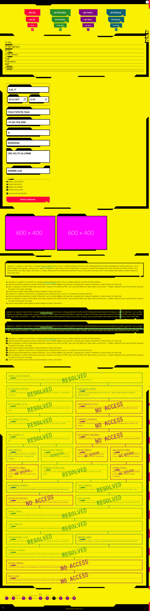
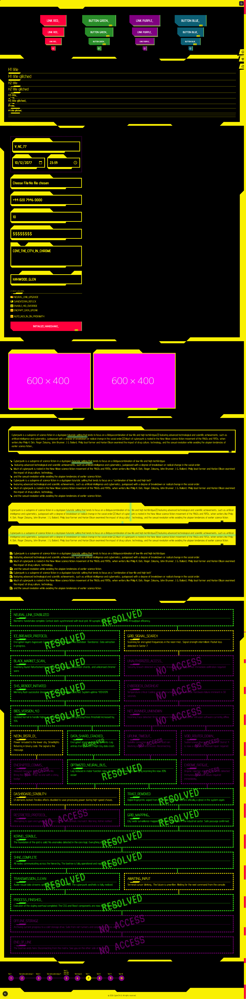

# 🦾 CyberCN UI


A modern, type-safe React component library built with **Next.js**, **Tailwind CSS**, and **CVA**, inspired by the classic retro-future Cyberpunk CSS aesthetics.

---

## 🖥️ Interface Preview

|      Light Mode (Original Aesthetic)      |        Dark Mode (Neon Protocol)        |
| :---------------------------------------: | :-------------------------------------: |
|  |  |

---

## 🧪 The Project

This is a **hobby project** dedicated to modernizing the iconic "Cyberpunk" CSS aesthetic. The original themes relied on heavy global selectors and rigid HTML structures. **CyberCN UI** reimagines these as modular, reusable, and type-safe components.

The goal is to provide a "shadcn-like" experience for high-aesthetic interfaces:

- 🧩 **Component Composition:** Flexible patterns like `BoxTree.Box`.
- 🎨 **Variant-Driven Styling:** Powered by `class-variance-authority` (CVA).
- 📱 **Modern Responsiveness:** Replaced complex media queries with Tailwind utilities.
- 🌑 **Dark Mode by Design:** Built to switch contexts seamlessly.

---

## 🕹️ Tech Stack

- **Framework:** [Next.js 14+](https://nextjs.org/)
- **Styling:** [Tailwind CSS](https://tailwindcss.com/)
- **Variants:** [CVA](https://cva.style/)
- **Language:** [TypeScript](https://www.typescriptlang.org/)
- **Icons/Fonts:** VT323 & custom cyberpunk typography.

---

## 📜 Credits & Origin

This project is a modern evolution of the iconic **Cyberpunk 2077 Theme** CSS.

- **Original Inspiration:** [Cyberpunk-2077-theme-css](https://github.com/gwannon/Cyberpunk-2077-theme-css) by [@gwannon](https://github.com/gwannon).
- **Modernization:** Refactored into a modular React ecosystem with a focus on performance and developer experience.

---

## 🛠️ Getting Started

1. **Clone the repo:**

```bash
git clone https://github.com/szvitek/cybercn-ui.git
```

2. **Install dependencies:**

```bash
npm install
```

3. **Run the development server:**

```bash
npm run dev
```

## 📦 Install via shadcn Registry

Install a component directly from the hosted registry:

```bash
npx shadcn@latest add "https://cybercn-ui.vercel.app/r/cyber-button.json"
```

Or register a reusable alias in your consumer app's `components.json`:

```json
{
  "registries": {
    "@cybercn": "https://cybercn-ui.vercel.app/r/{name}.json"
  }
}
```

Then install by alias:

```bash
npx shadcn@latest add "@cybercn/cyber-button"
```

Registry index:

- https://cybercn-ui.vercel.app/r/registry.json

Currently available component names:

- `cyber-button`
- `cyber-form`
- `cyber-header`
- `cyber-heading`
- `cyber-link`
- `cyber-steps`
- `cyber-boxtree`
- `cyber-aside`
- `cyber-section`
- `cyber-list`
- `cyber-paragraph`
- `cyber-hr`
- `cyber-image`
- `cyber-footer`

---

## 🗺️ Roadmap

- [ ] ~~Storybook Integration~~ — De-scoped: Superseded by Fumadocs examples.

- [x] CSS Variable Refactor: Fully unify the dark/light mode palette.
  - Status: Core variables locked; aesthetic verified across themes.

- [x] Unit Tests: Ensure stability across the component tree.

- [x] Documentation: Comprehensive guides for every component.
  - Status: Integrated with Fumadocs for seamless MDX management.

- [ ] ~~NPM Packaging: Set up tsup and package structure.~~ — De-scoped: in favor of shadcn reigistry release.

- [ ] Alpha Release: Publish @cybercn/ui.

- [x] Shadcn Registry: Prepare project for npx distribution.

- [ ] New Components: Expanding the library

## 📄 License

This is an open-source hobby project. Feel free to use it for your own digital underworlds.
